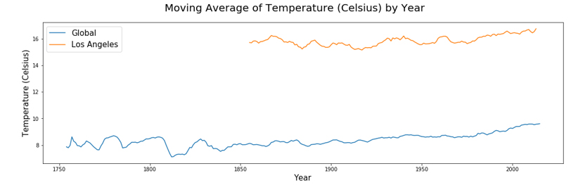

# OVERVIEW

This is Udacity's first project under Data Analyst Nanodegree Program. This project was focused on exploring a dataset by using SQL and making visualizations by using Python's Matplotlib. (Completed on November 17, 2018)

For this project, our task was to analyze local and global temperature data and compare temperature trends between our city and the world. We are to create visualization and prepare a report that would describe the similarities and differences between the global temperature trends to that of the closest large city that we live in. As part of this project, we were to extract data from the database using SQL and export it as a csv file. I then used Python to open the csv file and created line charts to analyze the temperature trends.

***

**Below, I wanted to share snippets of my code as well as my observations.**

# OBSERVATION \#1

I chose to do a line plot to visualize the data in order to best show the change of temperature overtime.

Due to being closer to the equator, it was no surprise that Los Angeles showed to be hotter on average compared to the global average.

By taking a look at the graph above, it looks like both Los Angeles as well as the Global temperature average has slightly increased overall throughout the years.

Has the difference been consistent over time? How do the changes in Los Angeles' temperature over time compare to the changes in the global average?

Let's further investigate this increase below!

# OBSERVATION \#2

## Change in Temperature

I created a new column for both data frames to show difference in average temperature.

I created a new column for both data frames to show the moving average for this difference.

Based on the graph and calculations above, the variability of change in average temperature is much larger for Los Angeles as compared to Global temperature.

# OBSERVATION \#3

## Positive vs Negative years

Now let's go ahead and compare the number of years in which there was a positive difference in temperature to the number of years in which there was a negative difference.

Based on our calculations above, the number of years in which our temperature was increasing far outweighs our years of decreasing for both Los Angeles and globally.

# OBSERVATION \#4

## OVERALL INCREASE

Based on our very first graph, we know that our average temperature is moving in an upward direction. Let's go ahead and compare proportionally how much they have increased from 1855 to 2013.

Just by looking at our graph, Los Angeles has increased in temperature (Celsius) of approximately 1 degree. Meanwhile, looking at our global graph, we can see that on average, the global temperature has increased about 1.5 degree Celsius from 1855 to 2013.

This means that if we continue at this rate, on average, we would see an increase of about .625 degree Celsius per 100 years for Los Angeles and .9375 degree Celsius globally.
